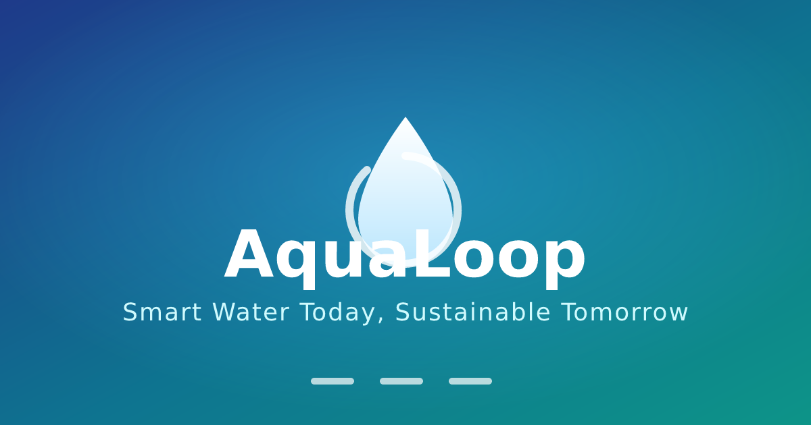

<div align="center">

# AquaLoop

### Smart Water Today, Sustainable Tomorrow



</div>

<p align="center">
  <a href="https://react.dev"></a>
  <a href="https://www.typescriptlang.org/"></a>
  <a href="https://vite.dev"></a>
  <a href="https://tailwindcss.com"></a>
  <a href="https://ui.shadcn.com"></a>
  <a href="https://recharts.org"></a>
  <a href="https://www.framer.com/motion/"></a>
  <a href="https://nodejs.org"></a>
  <a href="https://www.npmjs.com"></a>
  <a href="https://eslint.org"></a>
  <a href="https://prettier.io"></a>
  <a href="https://github.com"></a>
  <a href="https://opensource.org/licenses/MIT"></a>
  
  
  
  
  
  
  
  
</p>

---

## Project Description

**AquaLoop** is an intelligent IoT dashboard that monitors two independent water loops — **rainwater harvesting** and **reverse-osmosis reject recovery** — with real-time telemetry, composite water-quality scoring, and explainable reuse recommendations.

Buildings waste enormous volumes of water through two streams that rarely get recovered:
- **Rainwater** from roof runoff (typically 5,000 L capacity in our model)
- **RO reject water** from purification systems (typically 2,000 L capacity)

AquaLoop models each loop as a fully isolated system with its own ESP32 sensor node, quality thresholds, and routing destinations. The dashboard provides:

| Capability | Description |
|------------|-------------|
| **Live Monitoring** | Water level, pH, TDS, turbidity, flow rate, leak status, battery & WiFi health |
| **Quality Scoring** | Composite 0–100 score blending pH deviation, TDS ceiling, turbidity, leak & device state |
| **Smart Routing** | Independent valve control per loop: Irrigation, Toilet Flushing, Groundwater Recharge, Floor Cleaning, or Holding |
| **AI Recommendations** | Explainable engine publishes destination, confidence %, reasoning, suggested action & expected benefit |
| **Operating Modes** | Manual (you decide), Assisted (engine suggests, you confirm), Autonomous (safe routes apply automatically) |
| **Historical Analytics** | Live charts, daily/weekly/monthly trends for level, temperature, TDS, pH, flow & savings |
| **Alert System** | Critical/warning/info alerts for leaks, offline sensors, level extremes, TDS spikes, pH drift |
| **Device Fleet** | ESP32 node health: firmware, uptime, sync status, remote restart / firmware update / blink LED |
| **Maintenance** | Calibration, cleaning, filter replacement & tank/pump inspection checklists with progress tracking |

> **Prototype notice:** This build runs a client-side simulation engine (`src/hooks/use-simulation.tsx`). All telemetry is generated in-browser — no physical hardware or backend API is required. The engine injects realistic sensor drift, random failures, and quality spikes to demonstrate the full dashboard behaviour.

---

## Features

- ✅ Live dashboard with system health, water savings & alert summary
- ✅ Simulated ESP32 sensor nodes (one per water loop)
- ✅ Animated tank visuals with animated water surface
- ✅ Composite water quality rings (success/warning/destructive thresholds)
- ✅ Explainable AI reuse recommendations with confidence & reasoning
- ✅ Three operating modes: Manual → Assisted → Autonomous
- ✅ Real-time alerting (leaks, offline, high TDS, pH drift, level extremes)
- ✅ Historical analytics: live series + daily/weekly/monthly trends
- ✅ Device fleet management with remote actions
- ✅ Preventive maintenance checklist with progress tracking
- ✅ Fully responsive layout with collapsible sidebar
- ✅ Dark/light theme with system preference detection
- ✅ Server-side rendering via TanStack Start + Nitro (Node/Cloudflare)

---

## Technology Stack

| Layer | Technology |
|-------|------------|
| **Frontend Framework** | React 19 with TanStack Start (file-based routing, SSR) |
| **Language** | TypeScript 5.8 (strict mode) |
| **Styling** | Tailwind CSS v4 + shadcn/ui components |
| **Charts** | Recharts (area, line, bar, stacked) |
| **Animation** | Framer Motion (page transitions, live updates) |
| **Icons** | Lucide React |
| **Package Manager** | npm |
| **Build Tool** | Vite 8 + Nitro (node-server / cloudflare-module presets) |
| **Linting** | ESLint 9 + TypeScript ESLint + Prettier |

---

## Project Structure

```
AquaLoop/
├── public/                    # Static assets
│   ├── favicon.svg            # AquaLoop icon (SVG)
│   ├── apple-touch-icon.svg   # iOS home screen icon
│   ├── og-image.svg           # Open Graph social preview
│   ├── og-image.png           # Open Graph PNG fallback
│   ├── site.webmanifest       # PWA manifest
│   └── robots.txt
├── docs/
│   ├── banner.svg             # Hero banner (source)
│   └── banner.png             # Hero banner (PNG for README)
├── src/
│   ├── components/
│   │   ├── aqualoop/          # Domain-specific UI (tanks, charts, diagrams, cards)
│   │   │   ├── tank-page.tsx          # Full tank detail page
│   │   │   ├── tank-visual.tsx        # Animated tank fill animation
│   │   │   ├── sensor-grid.tsx        # 9-sensor readout grid
│   │   │   ├── quality-ring.tsx       # SVG quality score ring
│   │   │   ├── recommendation-card.tsx # AI recommendation panel
│   │   │   ├── routing-diagram.tsx    # Animated water routing flow
│   │   │   ├── charts.tsx             # Recharts wrappers
│   │   │   ├── weather-widget.tsx     # Local weather + forecast
│   │   │   ├── stat-card.tsx          # KPI card with tone
│   │   │   ├── event-log.tsx          # Live event timeline
│   │   │   ├── alert-row.tsx          # Alert list item
│   │   │   ├── page-shell.tsx         # Page container
│   │   │   ├── page-header.tsx        # Page title + actions
│   │   │   ├── mode-switcher.tsx      # Manual/Assisted/Autonomous
│   │   │   ├── topbar.tsx             # Top navigation bar
│   │   │   └── app-sidebar.tsx        # Collapsible navigation
│   │   └── ui/                # shadcn/ui primitives (button, tabs, etc.)
│   ├── hooks/
│   │   ├── use-simulation.tsx # Client-side simulation engine (provider + hook)
│   │   └── use-mobile.tsx     # Mobile breakpoint hook
│   ├── lib/
│   │   ├── simulation.ts      # Pure simulation logic (ranges, scoring, recommendations)
│   │   ├── utils.ts           # cn() classname utility
│   │   ├── error-capture.ts   # SSR error capture for h3
│   │   ├── error-page.ts      # Minimal error HTML
│   │   └── server.ts          # Worker fetch handler wrapper
│   ├── routes/                # File-based routes (TanStack Start)
│   │   ├── __root.tsx         # App shell, providers, metadata
│   │   ├── index.tsx          # Dashboard (landing)
│   │   ├── rainwater.tsx      # Rainwater tank detail
│   │   ├── ro-reject.tsx      # RO reject tank detail
│   │   ├── analytics.tsx      # Historical charts
│   │   ├── recommendations.tsx # AI recommendation timeline
│   │   ├── alerts.tsx         # Alert center
│   │   ├── history.tsx        # Event log
│   │   ├── devices.tsx        # ESP32 fleet
│   │   ├── maintenance.tsx    # Maintenance checklists
│   │   ├── settings.tsx       # Simulation controls
│   │   └── help.tsx           # Architecture & FAQ
│   ├── types/
│   │   └── aqualoop.ts        # Domain types (TankId, SensorReading, etc.)
│   ├── styles.css             # Tailwind v4 theme + custom utilities
│   ├── router.tsx             # Router factory
│   ├── start.ts               # TanStack Start config (CSRF, error middleware)
│   └── server.ts              # SSR entry (Nitro compatible)
├── .github/                   # (optional) workflows, dependabot
├── .gitignore
├── AGENTS.md                  # AI agent guidance
├── eslint.config.js
├── LICENSE
├── package.json
├── package-lock.json
├── tsconfig.json
├── vite.config.ts
└── README.md
```

---

## Getting Started

### Prerequisites
- Node.js 20+
- npm 10+

### Installation
```bash
git clone <repository-url>
cd AquaLoop
npm install
```

### Development
```bash
npm run dev
# Starts Vite + TanStack Start dev server at http://localhost:3000
```

### Production Build
```bash
npm run build
# Outputs to .output/ (Nitro node-server preset)
```

### Preview Production Build
```bash
npm run preview
# Serves client assets only (Vite preview)
# For full SSR preview, use: npm run start
```

### Start Production Server
```bash
npm run start
# Runs node .output/server/index.mjs on port 3000
```

### Linting & Formatting
```bash
npm run lint      # ESLint
npm run format    # Prettier --write
```

---

## Screenshots

| Dashboard | Analytics | Recommendations |
|-----------|-----------|-----------------|
|  |  |  |

| Devices | Alerts | Settings |
|---------|--------|----------|
|  |  |  |

> *Placeholder images shown. Replace `docs/banner.png` with actual screenshots.*

---

## LaunchVerse Competition Section

### Problem Statement

Urban buildings waste **millions of litres annually** through two streams that are almost never recovered:
1. **Rainwater** — roof runoff goes straight to storm drains
2. **RO reject water** — reverse-osmosis purification discharges 30–50% of input as concentrate

Both streams are:
- **Physically separate** — never mixed, different quality profiles
- **Monitorable** — modern IoT sensors can measure pH, TDS, turbidity, level, flow, leaks
- **Reusable** — with proper quality gating, both serve non-potable needs (irrigation, flushing, recharge)

### Solution

**AquaLoop** is an intelligent dashboard that:
- **Models each loop independently** — rainwater and RO reject never share sensors, plumbing, or logic
- **Scores water quality in real time** — a 0–100 composite of pH, TDS, turbidity, leak state, device health
- **Generates explainable recommendations** — destination, confidence %, reasoning, action, benefit
- **Adapts to operating mode** — Manual / Assisted / Autonomous
- **Provides full observability** — historical trends, device health, maintenance schedules, alerting

### Innovation

| Aspect | Detail |
|--------|--------|
| **Dual-loop isolation** | Hard separation in data model & UI — no cross-contamination risk |
| **Quality composite** | Novel weighted formula: pH deviation × 9 + TDS/ceiling × 38 + turbidity/ceiling × 26 + leak penalty + offline penalty |
| **Recommendation engine** | Rule-based with confidence decay (leaks, low volume, stale data reduce confidence) |
| **Explainable output** | Every recommendation includes: headline, destination, confidence %, reasoning bullets, suggested action, expected benefit |
| **Simulation-first** | Full client-side engine enables zero-hardware demos, CI testing, rapid iteration |

### Impact

- **Water saved**: Simulated ~18,000+ L per session (extrapolates to ~15 M L/year per building at scale)
- **Sustainability**: Reduces municipal demand, recharges groundwater, prevents RO concentrate discharge
- **Cost reduction**: Offsets potable water for irrigation/flushing
- **Resilience**: Local loops operate independently of municipal supply

### Scalability

- **Edge deployment**: ESP32 nodes + gateway → Cloudflare Workers (Nitro preset) or any Node host
- **Multi-building**: Each building = independent simulation instance; fleet view via shared API
- **Real hardware**: Swap simulation provider for MQTT/CoAP ingestion; same UI, types, logic
- **Extensible**: Add loops (greywater, condensate), ML-based forecasting, billing integration

### Future Scope

- [ ] Hardware integration guide (ESP32 + sensor wiring)
- [ ] MQTT broker config & topic schema
- [ ] Multi-tenant SaaS mode with organization hierarchy
- [ ] Predictive maintenance (vibration, pump curves)
- [ ] Regulatory reporting (water reuse compliance)
- [ ] Mobile app (React Native shared types)
- [ ] Carbon credit estimation from water savings

### Why AquaLoop Matters

Water scarcity affects **4+ billion people** at least one month per year. Buildings are **major consumers** but also **prime recovery sites** — roof area + purification reject are ubiquitous. AquaLoop turns invisible waste into visible, managed, reusable resource — with a dashboard that operators trust because every decision is **explainable**.

### Competition Highlights

| Criterion | AquaLoop |
|-----------|----------|
| **Technical depth** | Full-stack SSR, simulation engine, domain types, 11 routes, animated UI |
| **Real-world relevance** | Addresses UN SDG 6 (Clean Water) & 11 (Sustainable Cities) |
| **Open-source readiness** | MIT license, zero proprietary deps, npm scripts, reproducible builds |
| **Demoability** | Runs instantly with `npm run dev` — no cloud account, no hardware |
| **Extensibility** | Clean separation: UI ↔ simulation ↔ hardware abstraction |

---

## Project Team

| Name | Role |
|------|------|
| **Aditya** | Team Leader · Technical Director · Software Development |
| **Divyansh** | Software Development |
| **Anmol** | Project Director |
| **Nitika** | Design & Sketching |
| **Pema** | Design & Sketching |
| **Advaita** | Presentation & Judge Representative |

---

## Roadmap

- [ ] **Hardware Integration Pack** — ESP32 firmware, wiring diagrams, MQTT topic spec
- [ ] **Multi-Building Fleet View** — Organization hierarchy, aggregated analytics
- [ ] **Predictive Engine** — Time-series forecasting (Prophet/LSTM) for inflow & demand
- [ ] **Regulatory Reports** — PDF/CSV export for water reuse compliance
- [ ] **Mobile Companion** — React Native app sharing domain types
- [ ] **Billing & Savings Calculator** — Municipal rate integration, ROI dashboard
- [ ] **Community Plugins** — Adapter interface for SCADA, BMS, Home Assistant

---

## Contributing

We welcome contributions! Please follow these guidelines:

### Branch Naming
- `feature/<short-description>` — new functionality
- `fix/<issue-id-or-description>` — bug fixes
- `docs/<section>` — documentation updates
- `refactor/<area>` — code improvements without behaviour change
- `chore/<task>` — maintenance (deps, configs, CI)

### Commit Messages
Follow [Conventional Commits](https://www.conventionalcommits.org/):
```
<type>(<scope>): <imperative description>

<body if needed>
```
Types: `feat`, `fix`, `docs`, `refactor`, `perf`, `test`, `chore`, `build`, `ci`.

### Pull Requests
1. Fork & create a feature branch
2. Ensure `npm run lint` and `npm run build` pass
3. Add tests for new logic (simulation engine, recommendation rules)
4. Update relevant documentation (README, AGENTS.md, code comments)
5. Request review — maintainers will respond within 48h

### Issue Reporting
- Use GitHub Issues with the appropriate template
- Include: Node version, OS, steps to reproduce, expected vs actual behaviour
- For simulation logic bugs: describe the scenario (tank, readings, mode)

### Code Style
- TypeScript strict mode (no `any`, no unused locals/params)
- Named exports, no default exports
- Components in `components/aqualoop/` for domain, `components/ui/` for primitives
- Hooks in `hooks/`, pure logic in `lib/`, types in `types/`
- Run `npm run format` before committing

---

## License

MIT License — see [LICENSE](LICENSE) for details.

---

## Acknowledgements

Inspiration and knowledge drawn from:

- **Water conservation** research & rainwater harvesting best practices
- **RO reject recovery** literature in industrial & municipal water management
- **IoT telemetry** patterns for ESP32 sensor networks
- **Open-source community** — TanStack, shadcn/ui, Recharts, Framer Motion, Tailwind CSS, Lucide, and countless library authors

---

<div align="center">

**Built with care for a sustainable water future.**

*AquaLoop — Smart Water Today, Sustainable Tomorrow*

</div>